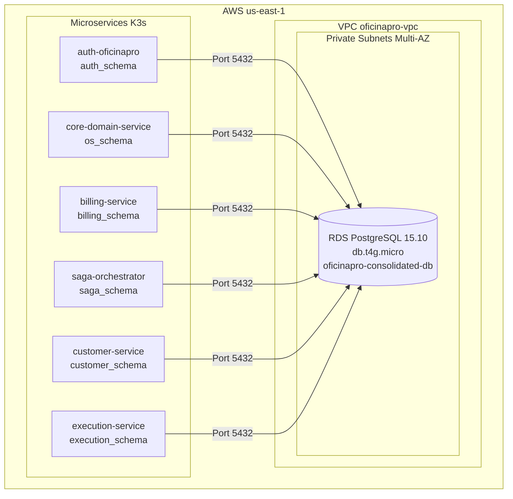

# OficinaPro Database - Infraestrutura Terraform

> Provisionamento de RDS PostgreSQL Multi-Schema - OficinaPro  
> **Última atualização:** 18 de Fevereiro de 2026

---

## 🎯 Visão Geral

O repositório **OficinaPro-Database** contém o código Terraform específico para provisionamento e gerenciamento do **Amazon RDS PostgreSQL** que serve como database consolidado para todos os microserviços do sistema.

---

## 🏗️ Arquitetura do Database



---

## 📂 Estrutura do Repositório

```
OficinaPro-Database/
├── main.tf                    # RDS instance + subnet group
├── variables.tf               # Variáveis de configuração
├── outputs.tf                 # Outputs (endpoint, port, etc.)
├── backend.tf                 # S3 backend para Terraform state
├── provider.tf                # AWS provider configuration
├── terraform.tfvars           # Valores das variáveis (NOT COMMITTED)
├── .terraform.lock.hcl        # Lock file de providers
└── docs/
    └── ARCHITECTURE.md        # Este arquivo
```

---

## 🔧 Configuração do RDS

### Especificações Técnicas

```hcl
resource "aws_db_instance" "oficinapro_consolidated" {
  # Identificação
  identifier              = "oficinapro-consolidated-db"
  
  # Engine
  engine                  = "postgres"
  engine_version          = "15.10"
  instance_class          = "db.t4g.micro" # ARM Graviton2 - cost optimized
  
  # Storage
  allocated_storage       = 20              # GB (inicial)
  max_allocated_storage   = 100             # GB (auto-scaling)
  storage_type            = "gp3"           # General Purpose SSD v3
  storage_encrypted       = true
  kms_key_id              = aws_kms_key.rds_encryption_key.arn
  
  # Credentials
  db_name                 = "oficinapro"
  username                = "oficinapro_admin"
  password                = var.db_password # From Secrets Manager
  
  # Network
  multi_az                = false           # Single-AZ (cost optimization)
  publicly_accessible     = false           # Private only
  vpc_security_group_ids  = [aws_security_group.rds_sg.id]
  db_subnet_group_name    = aws_db_subnet_group.rds_subnet_group.name
  
  # Backup & Maintenance
  backup_retention_period = 7               # 7 days
  backup_window           = "03:00-04:00"   # UTC (midnight BRT)
  maintenance_window      = "sun:04:00-sun:05:00"
  
  # High Availability
  deletion_protection     = true
  skip_final_snapshot     = false
  final_snapshot_identifier = "oficinapro-db-final-snapshot-${formatdate("YYYY-MM-DD-hhmm", timestamp())}"
  
  # Performance
  performance_insights_enabled = true
  performance_insights_retention_period = 7
  
  # Monitoring
  enabled_cloudwatch_logs_exports = ["postgresql", "upgrade"]
  monitoring_interval     = 60              # Enhanced monitoring
  monitoring_role_arn     = aws_iam_role.rds_monitoring_role.arn
  
  tags = {
    Name        = "oficinapro-consolidated-db"
    Environment = "production"
    ManagedBy   = "terraform"
    Project     = "oficinapro"
  }
}
```

---

## 🗄️ Schemas do Database

### Estrutura Multi-Schema

O RDS PostgreSQL consolidado utiliza **múltiplos schemas** para separação lógica dos dados por domínio:

```sql
-- Database: oficinapro
CREATE DATABASE oficinapro;

-- Schemas (criados via Liquibase de cada service)
CREATE SCHEMA IF NOT EXISTS auth_schema;       -- Lambda Auth
CREATE SCHEMA IF NOT EXISTS os_schema;         -- Core Domain
CREATE SCHEMA IF NOT EXISTS billing_schema;    -- Billing Service
CREATE SCHEMA IF NOT EXISTS saga_schema;       -- Saga Orchestrator
CREATE SCHEMA IF NOT EXISTS customer_schema;   -- Customer Service
CREATE SCHEMA IF NOT EXISTS execution_schema;  -- Execution Service
```

### Vantagens do Modelo Multi-Schema

✅ **Isolamento Lógico**: Cada serviço tem seu próprio namespace  
✅ **Redução de Custos**: 1 RDS instance em vez de 6  
✅ **Backup Unificado**: Snapshot único para todo o sistema  
✅ **Conexão Simplificada**: Mesmo endpoint para todos os serviços  
✅ **Migração Facilitada**: Liquibase gerencia schemas independentes  

---

## 🔐 Segurança

### Network Security

**Security Group Rules:**

```hcl
resource "aws_security_group" "rds_sg" {
  name        = "oficinapro-rds-sg"
  description = "Security group for RDS PostgreSQL"
  vpc_id      = var.vpc_id
  
  # Inbound: Apenas K3s Master e Lambda podem conectar
  ingress {
    description     = "PostgreSQL from K3s Master"
    from_port       = 5432
    to_port         = 5432
    protocol        = "tcp"
    security_groups = [var.k3s_master_sg_id]
  }
  
  ingress {
    description     = "PostgreSQL from Lambda"
    from_port       = 5432
    to_port         = 5432
    protocol        = "tcp"
    security_groups = [var.lambda_sg_id]
  }
  
  # Outbound: Nenhum (RDS não inicia conexões)
  egress {
    from_port   = 0
    to_port     = 0
    protocol    = "-1"
    cidr_blocks = ["0.0.0.0/0"]
  }
}
```

### Encryption

**At Rest:**
```hcl
resource "aws_kms_key" "rds_encryption_key" {
  description             = "KMS key for RDS encryption"
  deletion_window_in_days = 10
  enable_key_rotation     = true
  
  tags = {
    Name = "oficinapro-rds-encryption-key"
  }
}
```

**In Transit:**
- SSL/TLS obrigatório (enforced via `rds.force_ssl = 1`)

### IAM Authentication (Opcional)

```hcl
resource "aws_db_instance" "oficinapro_consolidated" {
  # ...
  iam_database_authentication_enabled = true # Permite IAM auth além de password
}
```

---

## 👥 Usuários do Database

### Usuário Admin (Terraform)

```sql
-- Criado pelo Terraform
CREATE USER oficinapro_admin WITH PASSWORD '<from-secrets-manager>';
GRANT ALL PRIVILEGES ON DATABASE oficinapro TO oficinapro_admin;
```

### Usuários por Schema (Liquibase)

Cada serviço cria seu próprio usuário via Liquibase:

```sql
-- Exemplo: auth_schema
CREATE SCHEMA IF NOT EXISTS auth_schema;
SET search_path TO auth_schema, public;

-- Grant permissions
GRANT ALL PRIVILEGES ON SCHEMA auth_schema TO oficinapro_admin;
GRANT ALL PRIVILEGES ON ALL TABLES IN SCHEMA auth_schema TO oficinapro_admin;
GRANT ALL PRIVILEGES ON ALL SEQUENCES IN SCHEMA auth_schema TO oficinapro_admin;
```

**Pattern:** Cada schema tem:
1. Schema creation (00-create-schema.sql/xml)
2. `SET search_path TO <schema>, public;`
3. Grants para `oficinapro_admin`
4. Fallback para `postgres` (dev local)

---

## 📊 Monitoramento

### CloudWatch Metrics

**Métricas Automáticas:**
- `CPUUtilization` (%)
- `FreeableMemory` (bytes)
- `FreeStorageSpace` (bytes)
- `DatabaseConnections` (count)
- `ReadLatency` / `WriteLatency` (seconds)

### Performance Insights

**Habilitado:** Sim (7 days retention)

**Queries Monitoradas:**
- Top SQL by execution time
- Wait events (IO, CPU, Lock)
- Database load by waits

### CloudWatch Alarms

```hcl
resource "aws_cloudwatch_metric_alarm" "rds_cpu" {
  alarm_name          = "oficinapro-rds-high-cpu"
  comparison_operator = "GreaterThanThreshold"
  evaluation_periods  = 2
  metric_name         = "CPUUtilization"
  namespace           = "AWS/RDS"
  period              = 300
  statistic           = "Average"
  threshold           = 80
  alarm_description   = "RDS CPU above 80%"
  
  dimensions = {
    DBInstanceIdentifier = aws_db_instance.oficinapro_consolidated.id
  }
}

resource "aws_cloudwatch_metric_alarm" "rds_storage" {
  alarm_name          = "oficinapro-rds-low-storage"
  comparison_operator = "LessThanThreshold"
  evaluation_periods  = 1
  metric_name         = "FreeStorageSpace"
  namespace           = "AWS/RDS"
  period              = 300
  statistic           = "Average"
  threshold           = 2147483648 # 2GB
  alarm_description   = "RDS storage below 2GB"
}
```

---

## 🔄 Backup & Recovery

### Automated Backups

**Configuração:**
- Retention: 7 dias
- Backup Window: 03:00-04:00 UTC (00:00-01:00 BRT)
- Incremental snapshots (delta changes)

### Manual Snapshots

```bash
# Criar snapshot manual
aws rds create-db-snapshot \
  --db-instance-identifier oficinapro-consolidated-db \
  --db-snapshot-identifier oficinapro-manual-$(date +%Y%m%d-%H%M)
```

### Point-in-Time Recovery (PITR)

**Habilitado:** Sim (via automated backups)

**RPO (Recovery Point Objective):** 5 minutos

```bash
# Restaurar para ponto específico no tempo
aws rds restore-db-instance-to-point-in-time \
  --source-db-instance-identifier oficinapro-consolidated-db \
  --target-db-instance-identifier oficinapro-restored \
  --restore-time 2026-02-18T10:30:00Z
```

### Disaster Recovery Plan

1. **RTO (Recovery Time Objective):** 1 hora
2. **RPO (Recovery Point Objective):** 5 minutos
3. **Backup Verification:** Automated monthly restore tests

---

## 🚀 CI/CD Pipeline

**Arquivo:** `.github/workflows/database-infra.yml`

```yaml
name: 'Terraform CI/CD - Database Infrastructure'

on:
  push:
    branches: [main]
    paths:
      - 'main.tf'
      - 'variables.tf'
  workflow_dispatch:
    inputs:
      action:
        type: choice
        options:
          - plan
          - apply

jobs:
  terraform:
    runs-on: ubuntu-latest
    
    steps:
    - name: Checkout
      uses: actions/checkout@v4
      
    - name: Configure AWS
      uses: aws-actions/configure-aws-credentials@v4
      with:
        aws-access-key-id: ${{ secrets.AWS_ACCESS_KEY_ID }}
        aws-secret-access-key: ${{ secrets.AWS_SECRET_ACCESS_KEY }}
        aws-region: us-east-1
        
    - name: Terraform Init
      run: terraform init
      
    - name: Terraform Plan
      run: terraform plan -out=tfplan
      
    - name: Terraform Apply
      if: github.event.inputs.action == 'apply'
      run: terraform apply -auto-approve tfplan
```

---

## 📈 Scaling Strategy

### Vertical Scaling (Instance Class)

**Current:** db.t4g.micro (1 vCPU, 1GB RAM)

**Upgrade Path:**
```
db.t4g.micro (1 vCPU, 1GB)    → $15/mês
db.t4g.small (2 vCPU, 2GB)    → $30/mês
db.t4g.medium (2 vCPU, 4GB)   → $60/mês
db.r6g.large (2 vCPU, 16GB)   → $150/mês (memory optimized)
```

### Storage Auto-Scaling

**Configuração:**
- Initial: 20GB
- Max: 100GB
- Threshold: 90% utilization
- Increment: 10GB

```hcl
max_allocated_storage = 100 # Auto-scales storage automatically
```

### Read Replicas (Futuro)

Para leitura intensiva:

```hcl
resource "aws_db_instance" "read_replica" {
  identifier              = "oficinapro-db-replica-1"
  replicate_source_db     = aws_db_instance.oficinapro_consolidated.identifier
  instance_class          = "db.t4g.micro"
  publicly_accessible     = false
}
```

---

## 💰 Análise de Custos

### Custos Mensais (us-east-1)

| Item | Especificação | Custo |
|------|---------------|-------|
| **RDS Instance** | db.t4g.micro (ARM) | $12.41 |
| **Storage** | 20GB gp3 | $2.30 |
| **Backup Storage** | 20GB (7 days retention) | $0.95 |
| **Data Transfer** | 10GB/mês (out) | $0.90 |
| **Performance Insights** | 7 days retention | $0.00 (free tier) |
| **TOTAL** | - | **~$16.56/mês** |

### Otimizações Aplicadas

✅ ARM Graviton2 (db.t4g instead of db.t3): **~20% economia**  
✅ gp3 instead of gp2: **~20% economia no storage**  
✅ Single-AZ instead of Multi-AZ: **~50% economia**  
✅ Consolidated database (1 instead of 6): **~70% economia total**

---

## 🧪 Testes de Conectividade

### Teste via psql (Local)

```bash
psql -h oficinapro-consolidated-db.cmz0ic48gh2u.us-east-1.rds.amazonaws.com \
     -U oficinapro_admin \
     -d oficinapro \
     -c '\dn' # List schemas
```

### Teste via K3s Pod

```bash
kubectl run -it --rm psql-test \
  --image=postgres:15 \
  --restart=Never \
  -- psql -h <RDS_ENDPOINT> -U oficinapro_admin -d oficinapro -c 'SELECT version();'
```

### Teste de Performance (pgbench)

```bash
# Inicializar
pgbench -i -h <RDS_ENDPOINT> -U oficinapro_admin -d oficinapro

# Benchmark (10 clients, 1000 transactions)
pgbench -c 10 -t 1000 -h <RDS_ENDPOINT> -U oficinapro_admin -d oficinapro
```

---

## 📚 Referências

- [Amazon RDS User Guide](https://docs.aws.amazon.com/rds/index.html)
- [PostgreSQL 15 Documentation](https://www.postgresql.org/docs/15/index.html)
- [AWS Graviton2 Performance](https://aws.amazon.com/ec2/graviton/)
- [Terraform AWS Provider - RDS](https://registry.terraform.io/providers/hashicorp/aws/latest/docs/resources/db_instance)

---

## 🔗 Outputs do Terraform

```hcl
output "rds_endpoint" {
  description = "RDS instance endpoint"
  value       = aws_db_instance.oficinapro_consolidated.endpoint
}

output "rds_port" {
  description = "RDS instance port"
  value       = aws_db_instance.oficinapro_consolidated.port
}

output "rds_db_name" {
  description = "Database name"
  value       = aws_db_instance.oficinapro_consolidated.db_name
}

output "rds_arn" {
  description = "RDS instance ARN"
  value       = aws_db_instance.oficinapro_consolidated.arn
}
```

---

**Autor:** OficinaPro Team  
**Versão:** 1.0.0  
**Terraform:** >= 1.6.0  
**Provider AWS:** ~> 5.0  
**PostgreSQL:** 15.10
